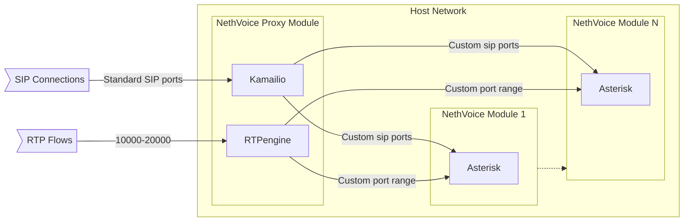

# ns8-nethvoice-proxy

NS8 NethVoice proxy module, a SIP and RTP proxy allows multiple instances of
NethVoice to be hosted on the same Node.
The proxy uses Kamailio and rtpengine as core components.

This module is developed by [evoseed](https://evoseed.io/) and maintained by Nethesis.
Most of the development is tracked privately inside [evoseed portal](https://nethesis.evoseed.it/).

## Module overview



## Install

Instantiate the module with:

    add-module ghcr.io/nethesis/nethvoice-proxy:latest 1

The output of the command will return the instance name.
Output example:

    {"module_id": "nethvoice-proxy1", "image_name": "nethvoice-proxy", "image_url": "ghcr.io/nethesis/nethvoice-proxy:latest"}

## Configure

Let's assume that the nethvoice-proxy instance is named `nethvoice-proxy1`.

Launch `configure-module`, by setting the following parameters:

- `fqdn`: name of Let's Encrypt certificate to use for Secure SIP connections, the phones must be
   configured to use this domain name as server SIP.
- `addresses`: configure the IP where the proxy will receive SIP and RTP connections/streams.
  - `address`: IPv4 address that is expected to receive VoIP traffic, **mandatory**.
  - `public_address`: public IPV4 address that is expected to receive
    VoIP traffic, in case of NAT.

Example:

    api-cli run module/nethvoice-proxy1/configure-module --data '{"fqdn": "example.com", "addresses": { "address": "192.168.1.1", "public_address": "1.2.3.4" }}'


## Debug

To enable Kamailio debug at runtime, launch

    kamcmd pv.shvSet debug int 1

TLS tracing is enabled when NethServer 8 support session is started, to enable it manually, launch

    kamcmd siptrace.status on 

## Uninstall

To uninstall the instance:

    remove-module --no-preserve nethvoice-proxy1

## Testing

Test the module using the `test-module.sh` script:

    ./test-module.sh <NODE_ADDR> ghcr.io/nethesis/nethvoice-proxy:latest

The tests are made using [Robot Framework](https://robotframework.org/)

### Test structure

- `tests/00_*.robot` — Module add/remove lifecycle
- `tests/01_*.robot` — Container health checks
- `tests/10_actions/` — API action validation and integration tests
- `tests/20_e2e_sipp/` — End-to-end SIP/RTP call tests using [SIPp](https://sipp.sourceforge.net/)

### E2E SIP/RTP tests

The `tests/20_e2e_sipp/` directory contains end-to-end tests that simulate real
SIP calls through the Kamailio proxy and verify RTP media flows through rtpengine.

**Prerequisites**: SIPp is automatically installed on the NS8 node during test setup.

**Scenarios covered**:
- Basic call signaling (INVITE/BYE/CANCEL/OPTIONS)
- RTP media flow verification through rtpengine
- Multi-PBX domain and trunk routing (2 simulated PBX endpoints)
- Dispatcher load balancing and failover
- Concurrent calls (5-10 simultaneous)
- SRTP↔RTP transcoding
- Codec negotiation (G.729, PCMA, PCMU, GSM)
- TLS signaling (port 5061)
- Topology hiding (TOPOS)
- NAT traversal (rport/contact-alias)
- In-dialog requests (re-INVITE hold/resume)

**SIPp scenario files** are in `tests/sipp_scenarios/` and are uploaded to the
node during test execution. To run only the E2E suite:

    robot -v NODE_ADDR:<addr> -v IMAGE_URL:<url> -v SSH_KEYFILE:~/.ssh/id_rsa \
        tests/20_e2e_sipp/

## Components

### Kamailio

Kamailio® (successor of former OpenSER and SER) is an Open Source SIP Server
released under GPLv2+, able to handle thousands of call setups per second.
Website: [kamailio](https://www.kamailio.org/w/)

### Postgres

PostgreSQL is a powerful, open source object-relational database system with over
35 years of active development that has earned it a strong reputation for
reliability, feature robustness, and performance.
Website: [postgresql](https://www.postgresql.org/)

### Redis

The open source, in-memory data store used by millions of developers as a
database, cache, streaming engine, and message broker.
Website: [redis](https://redis.io/)

### RTPengine

The Sipwise NGCP rtpengine is a proxy for RTP traffic and other UDP based media
traffic. It's meant to be used with the Kamailio SIP proxy and forms a drop-in
replacement for any of the other available RTP and media proxies.
Website: [RTPengine](https://github.com/sipwise/rtpengine)

## How to run locally

1. Compile the .env

   ```bash
   cp .env.template .env
   ```

   Edit the .env file and set the correct values

1. Build the docker image and run it

   ```bash
   cd modules/postgres
   make build
   make run && make log

   cd modules/redis
   make build
   make run && make log

   cd modules/rtpengine
   make build
   make run && make log

   cd modules/kamailio
   make build
   make run && make log
   ```

## How to run remotely (DEV or PROD Virtual Machine)

1. Copy in the remote server the `Makefile`
1. Run the `init` stage to creation of `ENV` file and needed folder
   (`only first time`)

   ```bash
   make init
   ```

1. Run all the pods

   ```bash
   make run-all
   ```
