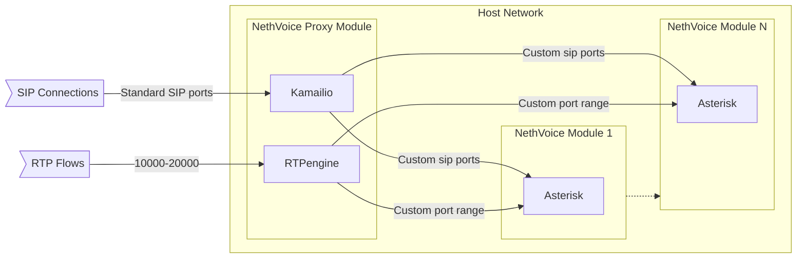

# ns8-nethvoice-proxy

NS8 NethVoice proxy module, a SIP and RTP proxy allows multiple instances of
NethVoice to be hosted on the same Node.
The proxy uses Kamailio and rtpengine as core components.

This module is developed by [evoseed](https://evoseed.io/) and maintained by Nethesis.
Most of the development is tracked privately inside [evoseed portal](https://nethesis.evoseed.it/).

## Module overview


```mermaid
flowchart LR
subgraph Host Network
    subgraph Proxy[NethVoice Proxy Module]
        Kamailio
        RTPengine
    end
    subgraph NethVoice1[NethVoice Module 1]
        Kamailio -- Custom sip ports --> Asterisk1[Asterisk]
        RTPengine -- Custom port range --> Asterisk1[Asterisk]
    end
    subgraph NethVoiceN[NethVoice Module N]
        Kamailio -- Custom sip ports --> AsteriskN[Asterisk]
        RTPengine -- Custom port range --> AsteriskN[Asterisk]
    end
    NethVoice1 -.-> NethVoiceN
end
sip>SIP Connections]-- Standard SIP ports --> Kamailio
rtp>RTP Flows]-- 10000-20000 --> RTPengine
```

## Install

Instantiate the module with:

    add-module ghcr.io/nethesis/nethvoice-proxy:latest 1

The output of the command will return the instance name.
Output example:

    {"module_id": "nethvoice-proxy1", "image_name": "nethvoice-proxy", "image_url": "ghcr.io/nethesis/nethvoice-proxy:latest"}

## Configure

Let's assume that the nethvoice-proxy instance is named `nethvoice-proxy1`.

Launch `configure-module`, by setting the following parameters:

- `fqdn`: name of Let's Encrypt certificate to use for Secure SIP connections, the phones must be
   configured to use this domain name as server SIP.
- `addresses`: configure the IP where the proxy will receive SIP and RTP connections/streams.
  - `address`: IPv4 address that is expected to receive VoIP traffic, **mandatory**.
  - `public_address`: public IPV4 address that is expected to receive
    VoIP traffic, in case of NAT.

Example:

    api-cli run module/nethvoice-proxy1/configure-module --data '{"fqdn": "example.com", "addresses": { "address": "192.168.1.1", "public_address": "1.2.3.4" }}'

## NAT scenario: local networks support

In on-premise installations where NethServer 8 is behind NAT
(`public_address` differs from `address`), Kamailio normally advertises
the public IP in SDP for all clients. Local clients (phones on the same
LAN) must then reach NethVoice through the public IP, which requires
hairpin NAT firewall rules — complex to configure and often unfeasible.

By providing the optional `local_networks` parameter the proxy avoids the
need for hairpin NAT by automatically:

1. Adding Kamailio listeners on ports **6060** (SIP/TCP/UDP) and **6061**
   (SIPS/TLS) bound to the private IP.
2. Creating firewall port-forwarding rules that redirect traffic arriving
   on 5060/5061 **from local network sources** to 6060/6061.
3. Configuring Kamailio to select `PRIVATE_IP:6060` as the outbound socket
   for destinations inside local networks, so the **private IP is
   advertised in SDP** for local clients — eliminating hairpin NAT.

Remote clients are unaffected and continue to use ports 5060/5061 with
the public IP in SDP.

The network directly attached to `address` is detected automatically from
the routing table. Additional subnets can be declared explicitly via
`local_networks`.

Example:

    api-cli run module/nethvoice-proxy1/configure-module --data \
      '{"fqdn": "proxy.example.com",
        "addresses": {"address": "192.168.1.1", "public_address": "1.2.3.4"},
        "local_networks": ["192.168.1.0/24", "10.0.0.0/8"]}'

The `local_networks` field accepts an array of CIDR-notation IPv4 subnets.
Port-forwarding rules are applied and removed automatically when the
configuration is updated or the module is destroyed.

## Service alerts

The proxy publishes five critical Prometheus alerts. Each condition must remain
true for **five minutes** before firing. Summaries and descriptions are available
in English and Italian, and descriptions identify the module instance and node.

| Unit | Alert name |
| --- | --- |
| `kamailio.service` | `NethVoiceProxyKamailioDown` |
| `rtpengine.service` | `NethVoiceProxyRTPengineDown` |
| `postgres.service` | `NethVoiceProxyPostgreSQLDown` |
| `redis.service` | `NethVoiceProxyRedisDown` |
| `systemd-exporter.service` | `NethVoiceProxySystemdExporterDown` |

For each application service, the rule checks that its unit is active while the
systemd exporter is reachable. For example:

```promql
(up{target_type="systemd"} == 1)
unless on(instance, module_id)
(systemd_unit_state{target_type="systemd", name="kamailio.service", state="active"} == 1)
```

Inactive and missing units both alert. Brief restarts reset the five-minute
timer. An exporter outage suppresses the four service alerts and instead uses
`up{target_type="systemd"} == 0` for the exporter alert. After the exporter
recovers, a service that remains unavailable starts a new five-minute timer.
Distinct alert names let each service recover independently.

The exporter must include `kamailio.service`, `rtpengine.service`,
`postgres.service`, and `redis.service`. The shipped include filter `.*` and
exclude filter `.*[.](device|mount|scope|slice|swap|target)$` satisfy this
requirement. Excluding a monitored unit makes it appear missing and triggers
its alert. Certificate jobs and other one-shot units have no alert rules.
These alerts monitor systemd availability, not SIP/RTP quality or application
response times. A removed scrape target has no `up` series and does not trigger
these rules.

### Publication and compatibility

[`prometheus-alert-rules`](imageroot/bin/prometheus-alert-rules) owns the
`systemd-exporter` and `core-services` fields of
`module/<MODULE_ID>/metrics_alert_rules`. Their deterministic YAML documents use
the groups `nethvoice-proxy.systemd-exporter` and `nethvoice-proxy.core-services`.
Metrics adds the authoritative `module_id` label and scopes each expression to
that instance. The publisher leaves unrelated hash fields untouched, skips
unchanged updates, and writes changes with the `{}` event payload to
`${AGENT_ID}/event/metrics-alert-rules-changed` in one Redis transaction.
Redis failures fail the command.

Creation, configuration, and upgrade publish targets before rules. Final restore
and clone hooks refresh both using the destination instance's runtime identity
and current environment. Removal deletes owned rules before targets. Both the
exporter port (`NETHVOICE_PROXY_SYSTEMD_EXPORTER_PORT`) and telemetry path
(`SYSTEMD_EXPORTER_PROMETHEUS_PATH`) must exist in the module's `environment`
file. Running `prometheus-alert-rules update` without either value removes
previously owned rules. FQDN setup is not required because all four application
services start during installation. Upgrades allocate the exporter port using
the `node:portsadm` role declared by the image.

To reconcile or remove only the owned rules, run on the hosting NS8 node:

```bash
runagent -m nethvoice-proxy1 prometheus-alert-rules update
runagent -m nethvoice-proxy1 prometheus-alert-rules remove
```

Evaluation requires the module-provided rule contract from
[ns8-metrics PR #91](https://github.com/NethServer/ns8-metrics/pull/91).
Older metrics versions can retain the published Redis data until upgraded.
Publication alone does not prove that rules have been validated and loaded:
check the metrics logs and Prometheus Rules page for groups such as
`ns8:nethvoice-proxy1:core-services:nethvoice-proxy.core-services`.
Notifications follow the existing metrics delivery settings. There is no new
alert configuration UI.

## Debug

To enable Kamailio debug at runtime, launch

    kamcmd pv.shvSet debug int 1

TLS tracing is enabled when NethServer 8 support session is started, to enable it manually, launch

    kamcmd siptrace.status on 

## Uninstall

To uninstall the instance:

    remove-module --no-preserve nethvoice-proxy1

## Testing

This module uses the NS8 standard testing infrastructure. For instructions on how to run the test suite locally, refer to the [Running tests locally](https://github.com/NethServer/ns8-github-actions/blob/v1/README.md#running-tests-locally).

### Alert publisher and Prometheus tests

Run these from the repository root with Python 3 and PyYAML installed:

```bash
python3 -m unittest discover -s tests/unit -v
python3 tests/prometheus/test_alert_rules.py --promtool /path/to/promtool
```

Use the `promtool` binary from
[Prometheus v3.5.3](https://github.com/prometheus/prometheus/releases/tag/v3.5.3).
The runner validates both authored and scoped rules, then executes 50 scenarios
covering healthy services, non-active states, missing/stale units, pending and
firing thresholds, brief restarts, recovery, exporter outages, and isolation
between services, endpoints, and module instances. Add `--output-dir /tmp/proxy-alert-tests`
to retain generated rule files and fixtures. Unit tests also cover Redis field
ownership, idempotence, environment guards, failure propagation, and lifecycle
hook ordering.

### NS8 acceptance tests

The standard Robot suite checks publication before FQDN configuration,
republication during configuration, and cleanup on module removal. Install
`tests/pythonreq.txt` dependencies in the test runner. The full suite installs,
reconfigures, and removes its own instance and requires a node with no existing
proxy.

The outage suite is **opt-in** and stops Kamailio and the exporter separately.
Use a disposable node hosting both the proxy and a compatible, active metrics
instance. All five monitored units must initially be running. Run only this
suite against an existing test instance with:

```bash
robot --variable NODE_ADDR:test-node.example.org \
  --variable SSH_KEYFILE:/path/to/private-key \
  --variable module_id:nethvoice-proxy1 \
  --variable RUN_METRICS_ALERT_RULES_E2E:True \
  --suite '12 Metrics Service Alerts' tests
```

It checks that all five rules are loaded and scoped, observes pending and firing
states, and starts the stopped service in teardown before checking recovery.
Allow about 15 minutes. Existing metrics notification routes remain in effect
during these deliberately induced outages.

After performing an upgrade, restore, or clone through the NS8 lifecycle API,
run the publication acceptance suite on the destination node. Set the relevant
instance variable and omit the others to skip their cases:

```bash
robot --variable NODE_ADDR:test-node.example.org \
  --variable SSH_KEYFILE:/path/to/private-key \
  --variable UPGRADED_MODULE_ID:nethvoice-proxy1 \
  --suite '13 Metrics Alert Lifecycle' tests
# Alternatively: --variable RESTORED_MODULE_ID:nethvoice-proxy2
# Or:           --variable CLONED_MODULE_ID:nethvoice-proxy3
```

These checks verify all five published rules and the target's destination module
ID, node, allocated exporter port, and telemetry path. They do not perform the
lifecycle operation themselves. For upgrade coverage, start with an older
version and compare configuration, routes, and trunks before and after the
update. For restore/clone coverage, use a destination node with a free proxy
slot, and verify that publication under the source instance is unaffected.

## Components

### Kamailio

Kamailio® (successor of former OpenSER and SER) is an Open Source SIP Server
released under GPLv2+, able to handle thousands of call setups per second.
Website: [kamailio](https://www.kamailio.org/w/)

### Postgres

PostgreSQL is a powerful, open source object-relational database system with over
35 years of active development that has earned it a strong reputation for
reliability, feature robustness, and performance.
Website: [postgresql](https://www.postgresql.org/)

### Redis

The open source, in-memory data store used by millions of developers as a
database, cache, streaming engine, and message broker.
Website: [redis](https://redis.io/)

### RTPengine

The Sipwise NGCP rtpengine is a proxy for RTP traffic and other UDP based media
traffic. It's meant to be used with the Kamailio SIP proxy and forms a drop-in
replacement for any of the other available RTP and media proxies.
Website: [RTPengine](https://github.com/sipwise/rtpengine)

## How to run locally

1. Compile the .env

   ```bash
   cp .env.template .env
   ```

   Edit the .env file and set the correct values

1. Build the docker image and run it

   ```bash
   cd modules/postgres
   make build
   make run && make log

   cd modules/redis
   make build
   make run && make log

   cd modules/rtpengine
   make build
   make run && make log

   cd modules/kamailio
   make build
   make run && make log
   ```

## How to run remotely (DEV or PROD Virtual Machine)

1. Copy in the remote server the `Makefile`
1. Run the `init` stage to creation of `ENV` file and needed folder
   (`only first time`)

   ```bash
   make init
   ```

1. Run all the pods

   ```bash
   make run-all
   ```
